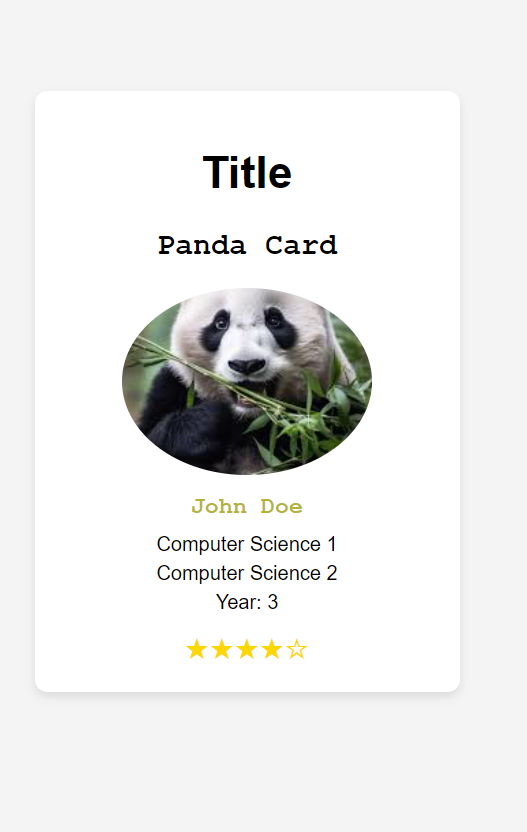

# web4_4
 Panda Card

This project creates a simple web-based "Panda Card" using HTML and CSS. The card displays a picture, personal information, and a rating with stars, all styled to create an attractive, easy-to-read layout.

## Features

- **Panda Card Design**: A clean and centered card layout that includes a profile picture, personal information, and a star rating system.
- **Responsive Layout**: The design is responsive and adapts to different screen sizes using `flexbox`.
- **Modern Styling**: Uses a mix of modern fonts (`Arial` and `Courier New`) and a color scheme designed to be visually appealing.

## Project Structure

- **HTML**: Basic structure of the web page containing a card with a title, image, and information about a user.
- **CSS**: Styles for centering content, adding padding and spacing, and creating visual effects like shadows, rounded corners, and custom fonts.

## Usage

1. Clone or download the repository to your local machine.
2. Open the `index.html` file in your preferred web browser.

## Customization

- **Image**: The card image is linked to an external source. To replace the image, simply change the `src` attribute in the `` tag to point to another image URL.
  
  ```html
  
Personal Information: Modify the name, courses, and year in the <h3> and <p> tags to display your desired information.

html
Copy code
<h3>Your Name</h3>
<p>Course 1</p>
<p>Course 2</p>
<p>Year: X</p>
Star Rating: You can adjust the star rating by changing the number of filled and empty star symbols (★ for filled, ☆ for empty) in the .stars div.

Example Screenshot

